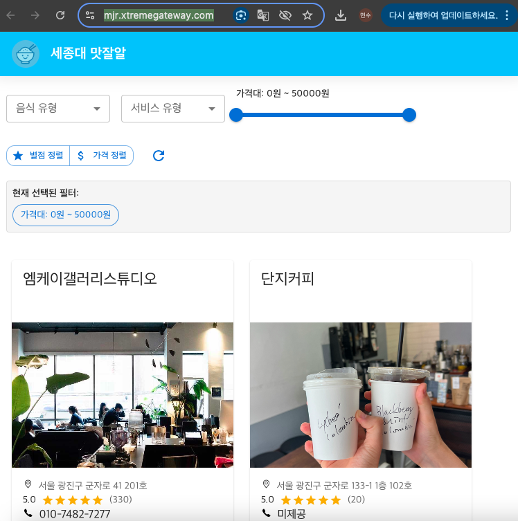

# Sejong Mat-Jal-R (세종대 맛잘알)

---

# 🍚 Sejong Mat-Jal-R

세종대학교 주변 맛집 정보를 보여주는 웹입니다.


세종대학교 및 광진구 인근의 음식점 데이터를 기반으로 사용자에게 **음식 유형, 매장 태그, 서비스 유형, 가격대** 필터를 통해 맞춤형 맛집 정보를 제공하는 웹 애플리케이션입니다.

---

## 📋 프로젝트 설명

**Sejong Mat-Jal-R**은 React와 Material UI를 기반으로 구축된 음식점 탐색 웹입니다.  
사용자는 원하는 조건을 선택해 세종대 주변의 다양한 맛집을 카드 형태로 간편하게 탐색할 수 있습니다.

---

## 💻 요구 사항

### 소프트웨어
- **Node.js**: v14 이상
- **npm**: v6 이상
- **React**: v18 이상
- **Google Chrome** (권장 브라우저)

### 하드웨어
- 최소 4GB 메모리 이상
- 1280px 이상의 화면 해상도 권장

---

## ⚙️ 설치 및 설정

```bash
# 1. 프로젝트 클론
git clone https://github.com/ooooo333i/Sejong-Mat-Jal-R.git
cd sejong-mat-jal-r
# 2. 패키지 설치
npm install

# 3. 개발 서버 실행
npm start
```

> `vsCode`로 실행 시 터미널을 이용하면 됩니다.

> `sejongMJR_data_final.json` 파일이 `src/` 또는 `src/data/` 폴더 안에 있어야 정상 작동합니다.

---

## 🚀 사용 방법

### 1. 필터 선택
- 음식 유형, 서비스 유형, 가격대는 드롭다운 + 슬라이더 UI로 구성
- 음식 유형을 선택하면 해당 유형에 맞는 태그 버튼이 자동 생성됨
- 태그 버튼을 클릭하면 해당 태그의 음식점만 필터링됨

### 2. 카드 목록 보기
- 각 음식점의 이름, 주소, 전화번호, 이미지, 리뷰 수, 평점 등이 카드에 표시됨
- 카드 왼쪽 하단 지도 그림 선택 시 대략적인 위치 정보 표시 및 카드 이미지 클릭 시 상세 페이지 이동

### 예시 화면



---

## 🧪 테스트 방법

다음과 같은 방식으로 확인 가능합니다:

1. `npm start` 후 웹을 실행
2. 다양한 필터 조합을 테스트
3. 콘솔 로그 또는 카드 렌더링을 통해 필터 정확성 확인
4. 스크롤 이동, 초기화 버튼 등 UI 기능 정상 작동 여부 확인

---

## 🤝 기여 방법

1. 이 저장소를 포크하세요 (`https://github.com/ooooo333i/Sejong-Mat-Jal-R.git`)
2. 새로운 브랜치를 생성하세요 (`git checkout -b feature/my-feature`)
3. 변경사항을 커밋하세요 (`git commit -m 'Add new feature'`)
4. 브랜치에 푸시하세요 (`git push origin feature/my-feature`)
5. Pull Request를 보내주세요 !

---

## 📄 라이선스

이 프로젝트는 [MIT License](https://opensource.org/licenses/MIT) 하에 배포됩니다.

MIT 라이선스는 다음을 허용합니다:
- 개인 및 상업적 사용
- 수정 및 배포
- 사본 제작
- 소프트웨어에 대한 저작권 및 라이선스 고지를 포함한 사용

단, 책임 및 보증이 없다는 조건이 포함됩니다.  
자세한 내용은 [LICENSE](./LICENSE) 파일을 참조하세요.

---

## 👤 저자 및 연락처

- **이름**: 안승기, 박재훈, 김재환, 박민수
- **소속**: 세종대학교  소프트웨어학과
- **이메일**:
- 안승기 : antmdrl0531@gmail.com
- 박재훈 : parkjaehoon1222@gmail.com
- 김재환 : jonny0010@gmail.com
- 박민수 : qkralstn8332@gmail.com
- **GitHub**:
- 안승기 : [@ooooo333i](https://github.com/ooooo333i)
- 박재훈 : [@UserPJh](https://github.com/UserPJh)
- 김재환 : [@Jonny-rose-Kim](https://github.com/Jonny-rose-Kim)
- 박민수 : [@mat-mins](https://github.com/mat-mins)

---

## 📚 참고 문헌

- [Material UI 공식 문서](https://mui.com/)
- [React 공식 문서](https://reactjs.org/)
- [Google Maps Platform Docs](https://developers.google.com/maps)
- [서울시 공공 데이터 센터](https://data.seoul.go.kr/)
  
